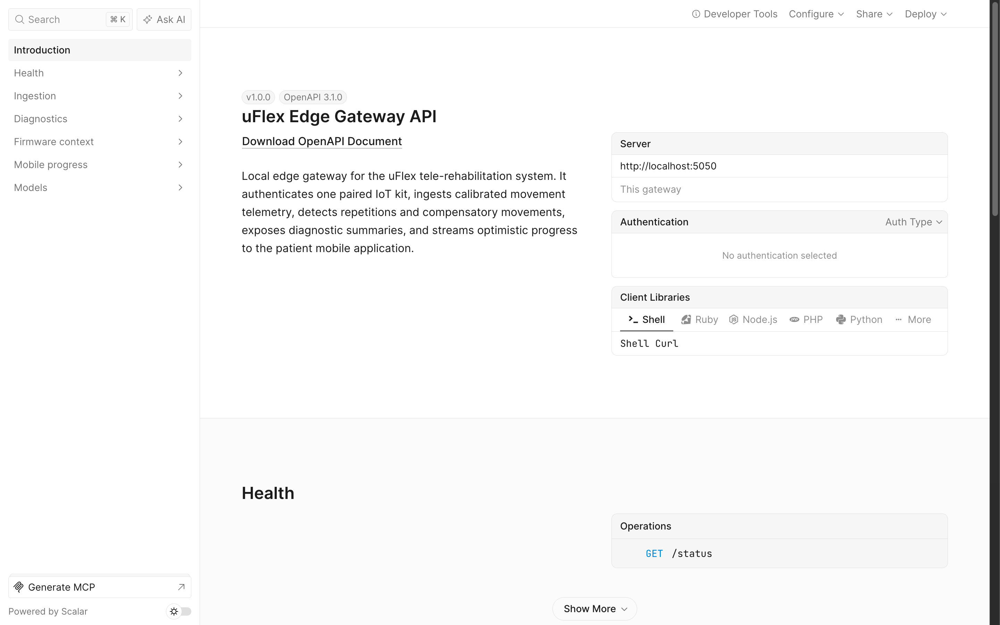
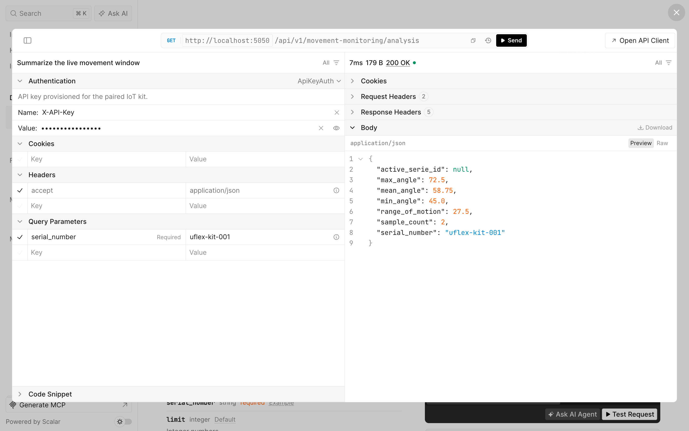
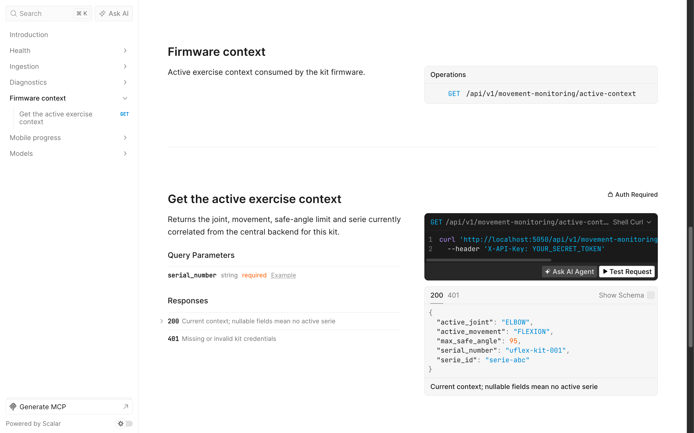
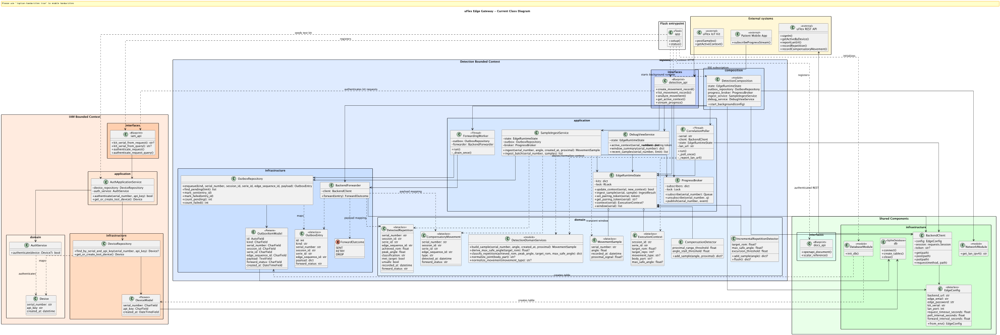

<h1 align="center">uFlex Edge Gateway</h1>

<div align="center">
  =3.13" />
  
  
  
  <br />
  
  
  
  
</div>

---

`uflex-edge-gateway` is the local IoT edge service that sits between a uFlex
rehabilitation kit, the patient mobile app, and the uFlex cloud backend. It runs
on the home/clinic LAN, authenticates one paired kit, receives movement telemetry
at the kit cadence, detects repetitions and compensatory movements in real time,
and forwards clinically relevant events to the backend through a durable outbox.

The gateway is intentionally stateful at the edge:

- the kit sends authenticated range-of-motion samples over HTTP
- the edge polls the backend for the active therapy serie assigned to that kit
- streaming detectors classify repetitions as `good`, `incomplete`, or `unsafe`
- compensation detection flags proximal movement while the target joint stalls
- detected events are queued in SQLite and forwarded idempotently to the backend
- the patient app can subscribe to live progress over Server-Sent Events (SSE)

## Edge API Tour

The gateway exposes a Scalar contract for local ingestion, movement analysis, active firmware context, and mobile progress streaming.





Movement-monitoring endpoints accept individual or batched sensor readings and expose processed records and analysis for the active therapy session.



The firmware polls a compact active context so it can apply the correct joint target and safety threshold at the wearable edge.

## Current Scope

This repository implements the current uFlex edge runtime for a **single kit per
edge process** (`1 edge <-> 1 kit`).

Implemented:

- kit authentication with `serial_number` (or legacy `device_id`) plus
  `X-API-Key`
- enriched firmware ingestion:
  `POST /api/v1/movement-monitoring/data-records` with
  `samples[{target_angle, proximal_signal?, recorded_at?}]`
- legacy single-sample ingestion with `{angle, created_at?}` for older clients
- active-serie correlation by polling the backend endpoint
  `/api/v1/therapy-sessions/active/by-device/{serial}`
- active context down-channel for firmware:
  `active_joint`, `active_movement`, `max_safe_angle`, and `serie_id`
- incremental hysteresis repetition detection per active serie
- compensation detection from proximal-segment motion
- durable SQLite outbox for repetitions and compensatory movements
- backend forwarding with `ROLE_EDGE` service-account sign-in, bearer refresh on
  `401`, and `X-Edge-Sequence-Id` idempotency keys
- mobile rendezvous by reporting the edge LAN URL to the backend
- live mobile progress via authenticated SSE with the backend-issued
  `edgePairingToken`
- in-memory debug views for recent samples and window analysis
- Scalar/OpenAPI endpoints at `/scalar` and `/openapi.json`; the API contract in
  this README reflects the current implemented routes

Not implemented yet:

- LAN TLS for the mobile SSE channel
- mDNS/cloudless edge discovery
- battery or kit-status telemetry
- production device enrollment; the local development kit is still seeded by the
  edge process

## Runtime Flow

1. The Flask process starts on `0.0.0.0:5050`.
2. On the first request, the gateway initializes SQLite, creates the `devices`
   and `outbox` tables, seeds the development kit, and starts background
   threads.
3. The correlation poller signs in to the backend as the edge service account,
   reports this edge's LAN URL, and polls for the active session/serie for
   `UFLEX_KIT_SERIAL`.
4. The kit asks for `active-context` and uses `active_joint`,
   `active_movement`, and `max_safe_angle` to select IMU pairs and enforce local
   safety.
5. The kit posts movement batches. The edge buffers a transient in-memory window,
   feeds the repetition and compensation detectors, and enqueues detected events.
6. The forwarding worker drains the outbox FIFO. Transient failures are retried;
   permanent rejections are quarantined so later entries can continue.
7. The mobile app discovers the edge LAN URL through the backend and subscribes
   to `progress-stream` using the session pairing token.

Raw samples are **not** durably stored anymore. SQLite persists only kit
credentials and the forwarding outbox; the backend owns therapy-session results.

## Architecture

The code follows a DDD-inspired layered architecture organized by bounded
context:

- **IAM**: local kit registry and inbound `serial_number` + `X-API-Key`
  authentication
- **Detection**: active execution context, streaming sample ingestion,
  repetition/compensation detection, progress publishing, and outbox forwarding
- **Shared**: SQLite configuration, backend HTTP client, runtime config, LAN
  address discovery, and API documentation

Each context is split into:

- `domain`: entities, value objects, and business rules
- `application`: use-case orchestration and runtime state
- `infrastructure`: Peewee models, repositories, backend adapters
- `interfaces`: Flask routes and request/response handling

```text
uflex-edge-gateway/
├── app/
│   ├── main.py
│   ├── detection/
│   │   ├── domain/
│   │   ├── application/
│   │   ├── infrastructure/
│   │   └── interfaces/
│   ├── iam/
│   │   ├── domain/
│   │   ├── application/
│   │   ├── infrastructure/
│   │   └── interfaces/
│   └── shared/
│       ├── infrastructure/
│       └── interfaces/
├── docs/
├── tests/
├── requirements.txt
├── requirements-dev.txt
└── pytest.ini
```



## Technology Stack

- Python 3.13+
- Flask 3.1
- Peewee 4 with SQLite/WAL
- Requests for backend communication
- python-dateutil for timestamp parsing
- pytest for the test suite

Exact dependencies are declared in [`requirements.txt`](requirements.txt) and
[`requirements-dev.txt`](requirements-dev.txt).

## Getting Started

### 1. Create a virtual environment

```sh
python -m venv .venv
source .venv/bin/activate
# Windows PowerShell: .venv\Scripts\activate
```

### 2. Install dependencies

```sh
pip install -r requirements.txt
pip install -r requirements-dev.txt
```

### 3. Configure the edge

The app reads configuration from environment variables. Copy
[`.env.example`](.env.example) as a reference, but export the variables in your
shell or process manager; this project does not depend on `python-dotenv`.

| Variable | Default | Purpose |
| --- | --- | --- |
| `UFLEX_BACKEND_URL` | `http://localhost:8080` | Base URL of the uFlex REST API, without `/api/v1` |
| `UFLEX_EDGE_EMAIL` | empty | Edge service-account email used to sign in to the backend |
| `UFLEX_EDGE_PASSWORD` | empty | Edge service-account password |
| `UFLEX_KIT_SERIAL` | `uflex-kit-001` | Serial of the single kit served by this edge |
| `UFLEX_EDGE_LAN_PORT` | `5050` | Port used to build the LAN URL reported to the backend |

For local-only ingest/debug calls, the seeded development kit is enough. Backend
polling and forwarding require `UFLEX_EDGE_EMAIL` and `UFLEX_EDGE_PASSWORD`.

### 4. Run the service

```sh
python -m app.main
```

The development server listens on `http://0.0.0.0:5050`. Run it as a module from
the repository root so absolute `app.*` imports resolve correctly.

### 5. Run tests

```sh
pytest
```

## Development Kit

On first bootstrap, the gateway seeds this local kit if it does not exist:

- `serial_number`: `uflex-kit-001`
- `api_key`: `test-api-key-123`

These credentials are for local development only. Do not reuse them in real IoT
deployments.

## API Contract

### Health and docs

| Method | Path | Purpose |
| --- | --- | --- |
| `GET` | `/status` | Health check |
| `GET` | `/openapi.json` | OpenAPI document served by the gateway |
| `GET` | `/scalar` | Scalar API reference UI |

### Kit ingestion

`POST /api/v1/movement-monitoring/data-records`

Required headers:

- `Content-Type: application/json`
- `X-API-Key: <kit api key>`

Current firmware batch payload:

```json
{
  "serial_number": "uflex-kit-001",
  "samples": [
    {
      "target_angle": 12.4,
      "proximal_signal": 2.1
    },
    {
      "target_angle": 28.8,
      "proximal_signal": 2.4
    }
  ]
}
```

The edge accepts the batch in order and stamps `recorded_at` on receipt when the
firmware omits it.

Success response:

```json
{
  "serial_number": "uflex-kit-001",
  "accepted": 2
}
```

Legacy single-sample payload:

```json
{
  "serial_number": "uflex-kit-001",
  "angle": 92.5,
  "created_at": "2026-05-29T18:23:00-05:00"
}
```

Legacy response:

```json
{
  "serial_number": "uflex-kit-001",
  "angle": 92.5,
  "recorded_at": "2026-05-29T23:23:00+00:00"
}
```

### Firmware active context

`GET /api/v1/movement-monitoring/active-context?serial_number=uflex-kit-001`

Required header:

- `X-API-Key: <kit api key>`

Response:

```json
{
  "serial_number": "uflex-kit-001",
  "active_joint": "ELBOW",
  "active_movement": "FLEXION",
  "max_safe_angle": 85.0,
  "serie_id": "123"
}
```

When no serie is active, the context fields are `null`.

### Mobile progress stream

`GET /api/v1/movement-monitoring/progress-stream?serial_number=uflex-kit-001`

Authentication:

- preferred: `Authorization: Bearer <edgePairingToken>`
- fallback/debug: `pairing_token=<edgePairingToken>` query parameter

The stream emits SSE `rep` events:

```text
event: rep
data: {"serie_id":"123","reps_detected":1,"classification":"good","recorded_at":"2026-05-29T23:23:00+00:00"}
```

The stream also emits comment heartbeats while idle.

### Debug views

| Method | Path | Purpose |
| --- | --- | --- |
| `GET` | `/api/v1/movement-monitoring/data-records?serial_number=...&limit=100` | Recent in-memory samples |
| `GET` | `/api/v1/movement-monitoring/analysis?serial_number=...` | Summary over the in-memory sample window |

Both endpoints also accept legacy `device_id`.

## Backend Integration

The gateway talks to these backend paths through the authenticated edge service
account:

- `POST /api/v1/authentication/sign-in`
- `GET /api/v1/therapy-sessions/active/by-device/{serial}`
- `PUT /api/v1/iam/edge-service-accounts/me/lan-url`
- `POST /api/v1/therapy-sessions/{sessionId}/series/{serieId}/repetitions`
- `POST /api/v1/therapy-sessions/{sessionId}/compensatory-movements`

Forwarded repetitions use this backend payload shape:

```json
{
  "peakAngle": 78.3,
  "achievedRom": 66.1,
  "classification": "Good",
  "recordedAt": "2026-05-29 23:23:00.000"
}
```

Every forwarded outbox entry includes `X-Edge-Sequence-Id` so backend retries can
be deduplicated.

## Operational Notes

- The development server is useful for demos and LAN testing; production
  packaging should provide a real process manager and TLS story.
- Bootstrap currently happens lazily before the first request.
- SQLite is configured with WAL and a busy timeout so Flask request threads and
  the forwarding worker can share the database.
- If the backend is temporarily down, ingest can still enqueue events; forwarding
  resumes when connectivity returns.
- A missing `targetRom` from the backend causes repetitions to classify as
  `good` unless they cross the derived safety ceiling.
- `max_safe_angle` is derived at the edge as `target_rom + 15`.

## Documentation

Additional documentation is available in [`docs/`](docs):

- [`docs/movement-monitoring-api.md`](docs/movement-monitoring-api.md): movement
  monitoring request/response details.
- [`docs/demo-expo.md`](docs/demo-expo.md): demo flow notes.
- [`docs/user-stories.md`](docs/user-stories.md): technical user stories and
  acceptance criteria.
- [`docs/class-diagram.puml`](docs/class-diagram.puml): PlantUML class diagram.
- [`docs/edge-execution-design.md`](docs/edge-execution-design.md): older
  execution-design notes; parts of this file predate the current streaming
  detector and outbox design.

## License

This project is licensed under the MIT License. See [`LICENSE.md`](LICENSE.md)
for details.
